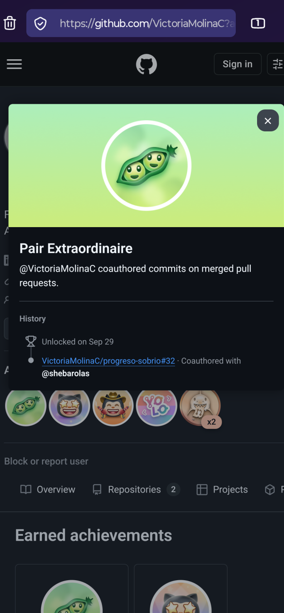
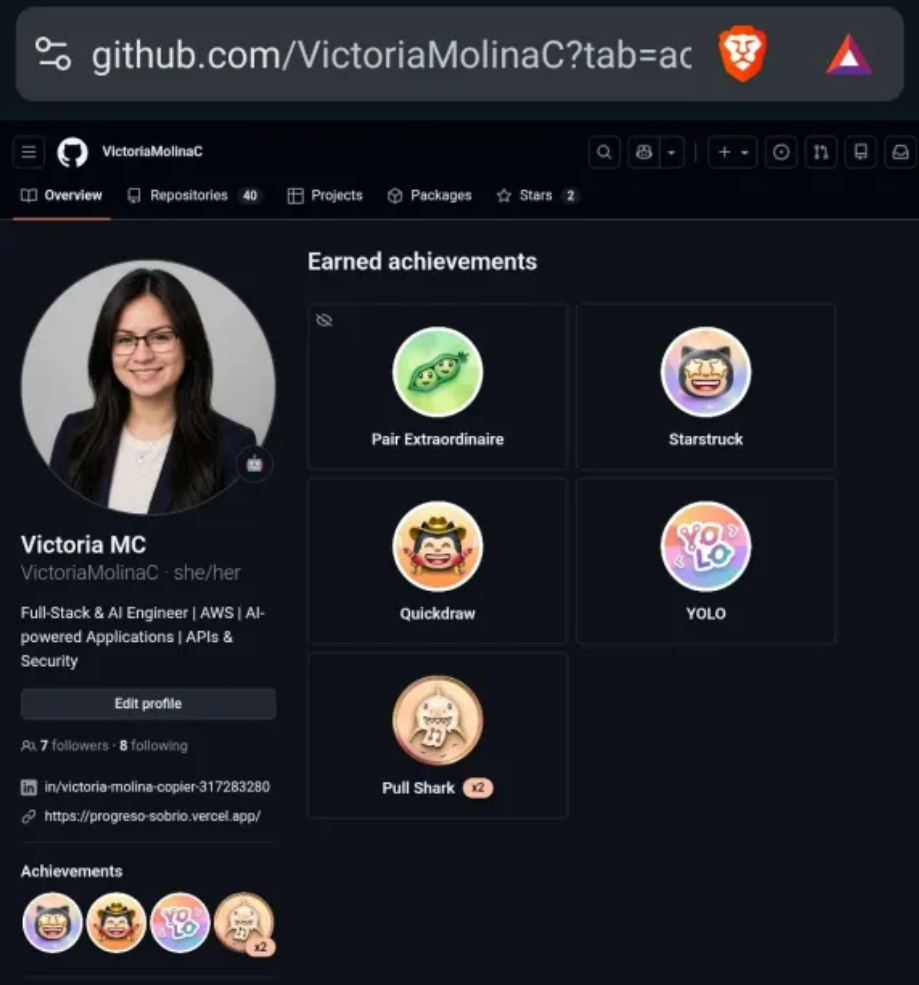

# Mis logros de GitHub 🏆

Insignias que he obtenido en GitHub y lo que significa cada una.

## Logros

- **Pair Extraordinaire**: coautoría de commits en pull requests fusionados (merged). Desbloqueado el 29 de septiembre en [progreso-sobrio#32](https://github.com/VictoriaMolinaC/progreso-sobrio/pull/32).
- **Starstruck**: creé un repositorio que recibió estrellas de la comunidad.
- **Quickdraw**: cerré un issue o pull request en menos de 5 minutos desde que lo abrí.
- **YOLO**: fusioné un pull request sin pasar por revisión.
- **Pull Shark (x2)**: tuve pull requests fusionados; el "x2" indica el segundo nivel de la insignia.

## Insignias

---

Perfil: [VictoriaMolinaC](https://github.com/VictoriaMolinaC?tab=achievements)
